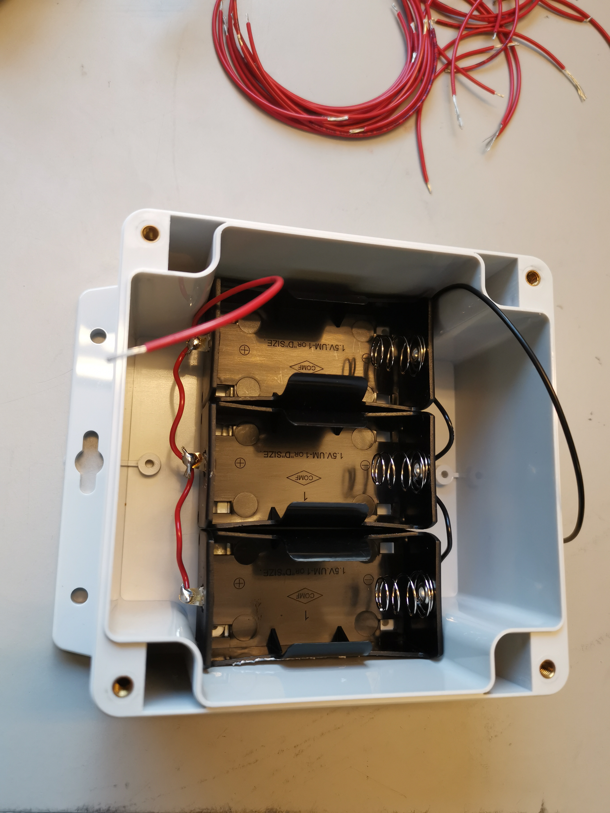

# Instructions for building the waves in ice instruments

## Preparation of the power supply part: making the 3 battery holders in parallel ready

- tape 3 D-cell battery holders in the same direction (to be used in parallel)
- some D-cell battery holders have bad contacts; put 1 cell in each battery holder, and check that the voldate is transmitted to the solder pins; if not, fix with some solder
- connect 3 D-cell battery holders in parallel (follow usual conventions: + is red, - / ground is black)
- add 1 red (middle long) and 1 black (long) wire coming out of the 3 batteries assembly
- fix the battery holders at the bottom of the box with some duct tape

## Preparation of the electronics boards

- program the Artemis
- cut 1 LED pad Artemis
- cut 2 LED pads qwiic switch
- connect Artemis to qwiic switch
- connect qwiic switch to 9dof
- solder the power supply to the Artemis
- position all the components on the plastic support plate
- put the antenna in place

## Final test and assembly

- register on Rock7
- perform a full test outside
  - notes about the colors of the LEDs
- glue inside
- glue outside

